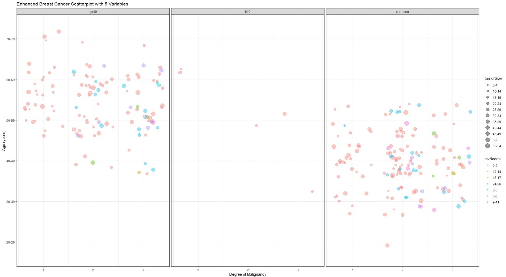

**Background Information and Definition**

Breast cancer is a very dangerous disease prevalent in women across the world. The reasons leasing to an individual developing breast cancer are many. This publication issue presents an analysis on the correlation between several factors associated with cases.

**Business Understanding**

With the advancements of technology, these types of problems accumulate different types of data sets that can be analyzed to help fight the disease. This can be done with the different tools available, and the data sets provided by medical establishments.

**Data Understanding**

The data used in this study is obtained from the University Medical Center, Institute of Oncology, Ljubljana, Yugoslavia. The data set obtained from the website: https://archive.ics.uci.edu/ml/datasets/breast+cancer contains different types of attributes and a total of 286 entries. Some of the information about these attributes can be found at the website referenced below. For this study, only 5 of those attributes were considered, namely:

The data used in this study is categorized as follows:

- Age (in years) comes in the range 10-99 (inclusive)
- Menopause in stages: lt40, ge40, premeno.
- Tumor size in millimeters in the range 0-59 (inclusive)
- Inv-nodes in the range 0-39 (inclusive)
- Degree of malignancy in the range 1-3 (inclusive)

The table below outlines the respective variable names with their possible values.

| **Attribute variable name** | **Attribute Value** |
| --- | --- |
| age | 10-19, 20-29, 30-39, 40-49, 50-59, 60-69, 70-79, 80-89, 90-99 |
| menopause | lt40, ge40, premeno |
| tumor-size | 0-4, 5-9, 10-14, 15-19, 20-24, 25-29, 30-34, 35-39, 40-44,45-49, 50-54, 55-59 |
| inv-nodes | 0-2, 3-5, 6-8, 9-11, 12-14, 15-17, 18-20, 21-23, 24-26,27-29, 30-32, 33-35, 36-39 |
| deg-malig | 1, 2, 3 |

**Limitations**

Most of the numeric values such as age, tumor size, etc., were in the for of ranges, for example, age had the entry of 10-19 instead of a single value within the range. This made some of the data manipulation a little different in the traditional sense since now the intervals were all within a range inside the age attribute for example. Initially this caused a problem where all data points were stacked on top of each other shown in the following example.

To better appreciate the different data points, the function &#39;jitter&#39; was applied to the plot to create some noise and spread out the points. This can be appreciated in the following sections.

**Data Preparation**

The data set provided by the institute of oncology contained 286 different entries of which some of them had missing data. To maintain the integrity of the data, those entries with missing data on them were removed.

The missing data found resided in only two of the 10 total columns. These were: node caps and breast quadrant. This cleansing in the end brought the total count from 286 to 278, resulting in a ~3% size reduction.

\*Steps conducted in the data manipulation can be found as comments within the R code.

**Modeling &amp; Results**

The model constructed can be found in the last page on the appendix, its most important sections will be analyzed individually. The x axis is comprised of the age of the women of the data set. Followed by the y axis which is defined by the degree of malignancy. This attribute degree of malignancy is defined in 3 possible values, 1 which predominately consists of cancer cells; 2 that consists of general characteristic of cancer cells; and 3 which consists of cells that are not part of the previous categories but are also affected.

Since the faceting group in40 of the menopause category only yielded a few results, it an be disregarded to focus on the other 2 groups, pre-menopause and late menopause (ge40).

The first clear result is the increased apparition of tumors in women who start their menopause after 50 being years old. In the same graphic it can be observed that the degree of malignancy 1 contains only axillary lymph nodes on the low ranges of 0-2. This can be observed as all the colors of the axillary lymph nodes reside mainly in the degrees 2 and 3 of the x axis.

In contrast, women in the pre-menopause stage have a noticeable shift in age as most of the data points shift down, starting at 30 instead of 50 as it can be seen from the 2 images. However, the same degree of malignancy tendency seems to apply in the same way in relation to the axillary lymph nodes.

