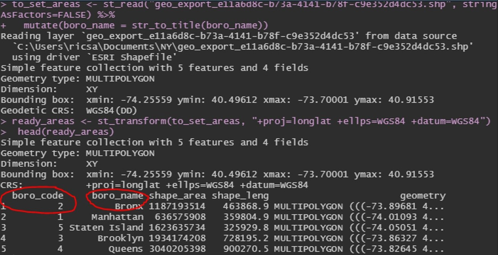
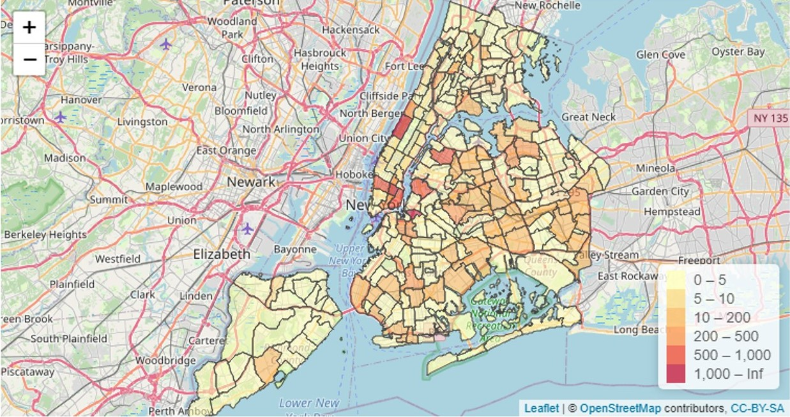
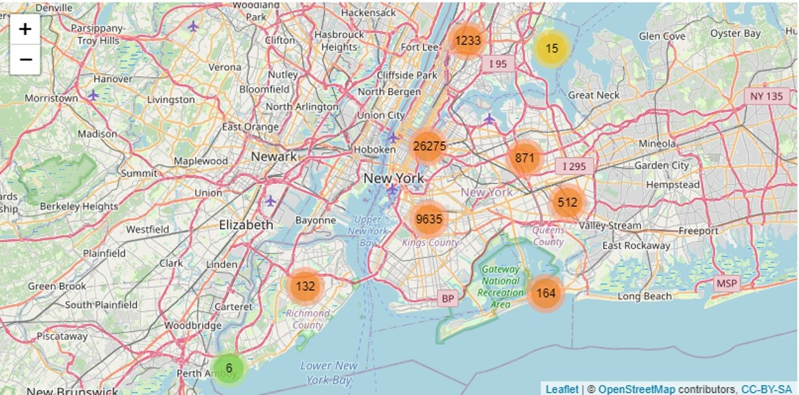
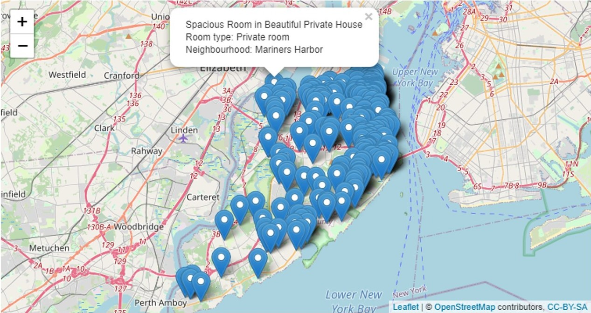
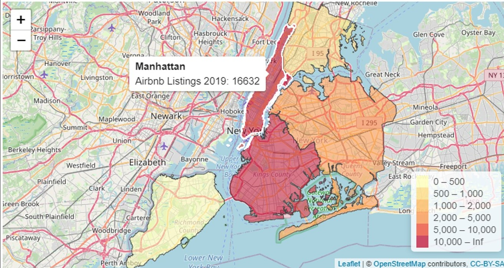

Airbnb data analysis

**Background Information and Definition**

Airbnb is an accommodations service where a user can select from a list of places to stay at for several nights at an affordable price. Airbnb is so flexible since it provides many different options a customer can choose from. Depending on the place, there can be many or few listings. This paper will focus on Airbnb data from the city of New York in 2019. This paper presents a summary analysis of the Airbnb listings of New York.

**Business Understanding**

New York is a great city that attracts many visitors at different time of the year. These visitors in turn need to find affordable accommodations. Airbnb provides a vast catalog of options for customers to select from. Understanding and reading all the listings is important to get the most value out of a booking. Analyzing Airbnb data can provide value by seeing where people are staying and the prices they are willing to pay for accommodations.

**Data Understanding**

There are two different types of data used in this analysis. The Ney York borough boundaries (geographic) data, and the Airbnb data set containing all the entries. The data used in this study is obtained from the city of New York website (geographic data). The data contains information about Airbnb listing from the year 2019 in the form of a CSV file.

The table below outlines the respective variable names of the Airbnb date, these can be easily interpreted due to the naming convention used.

| **Attribute Variable Name** | **Attribute Value Type** | **Example Entry** |
| --- | --- | --- |
| id | integer | 2539 |
| name | character | Clean &amp; quiet apt home by the park |
| host\_id | integer | 2787 |
| host\_name | character | John |
| neighbourhood\_group | character | Brooklyn |
| neighborhood | character | Harlem |
| latitude | number | 40.6 |
| longitude | number | -74 |
| room\_type | character | Private Room |
| price | integer | 225 |
| minimum\_nights | integer | 3 |
| number\_of\_reviews | integer | 49 |
| last\_review | character | 10/19/18 |
| reviews\_per\_month | number | 0.1 |
| calculated\_host\_listings\_count | integer | 1 |
| availability\_365 | integer | 365 |

**Data Preparation**

The data provided by the city of New York contained the geometric boundaries of the 5 distinct boroughs respectively: Brooklyn, Manhattan, Staten Island, Queens, and Bronx.

The most critical part of this analysis was mapping the values from the two different sets of data. That is getting the locations from the csv Airbnb data and attaching it to the geographic/geometry data. This was done through a join function that goes through all the entries of the csv file and assigns them a borough region depending on their neighborhood name.

This is a hard part since dataset will use different names for their variables. In this case. By inspecting the data, I was able to find the respective variable names used to map these values. The data contained the names of the boroughs and a number associated with it. Borough name was called _ **boro\_name** _ and its area code were called _ **boro\_code** _. This information was crucial for data preparation process.

_Figure 0.1. Finding variable names for mapping_

\*Specific steps conducted in the data manipulation process can be found as comments within the R code.

\*The data was reduced from around 48,000 entries to about 38,000 due to some of them missing fields.

**Limitations (Post- data manipulation)**

The engine used to map the markers seems to use quite an amount of memory. My computer has 8GB of ram and it couldn&#39;t handle plotting all the markers for all the data points, therefore, I dived the plotting in several intervals. One of them was by boroughs, that is plotting all the markers of one borough at the time, but even then, it had problems rendering them and lasted too much time, or got stuck.

**Modeling &amp; Results**

First, I wanted to go more in depth with the listings to see which specific neighborhood areas had Airbnb listings since the borough map data only contained 5 areas. After getting familiar with the mapping process, I tried to go into further detail and divide the map into neighborhoods instead of boroughs. I wanted to map the neighborhood entries in the Airbnb data to the geographic neighborhoods data from the city of New York. The problem was that for the most part the neighborhoods did not have the same name in both sets of data which left out many entries after mapping.

_Figure 1. New York City Airbnb listings divided by neighborhoods._

As you can observe in the image above, some of the areas are in the 0-5 Airbnb listings category (meaning there are no listings). This doesn&#39;t match what the actual data is. So, this process was stopped since the data preparation for this to work would involve manually changing names of the Airbnb listing to match the names of the geographic data. Other alternative would be writing an algorithm that detects similar names and use those, but in the end, it would cost too much time.

Next, I wanted to see the clusters of Listings to find out which area had the most concentration. On the next image we can see that most of the entries were centered where Manhattan meets Brooklyn, around the center area of the image.

_Figure 2. Airbnb listings by cluster_

Alone in the Staten Island borough there were listed about 300+ places when zooming in. As it can be seen in the image below, most of these listings are close to the shore on the east side of the Island.

_Figure 3. Airbnb listings of Staten Island_

All the Airbnb listings grouped by borough. This was done by simply grabbing all the entries, removing all the entries with at least one missing field, such as missing price, name, etc. Then mapping them to the spatial data by using a left join function.

The Airbnb listings are concentrated in 2 main areas, Manhattan, and Brooklyn, as it can be seen from the image below. The range selected for the intervals showcases how many listings the main areas have, but also, how little Staten Island has for example.

_Figure 4. Airbnb listings by borough._
